# OpenVINO_Model_Zoo

| モデル名 | 入力画像 | 出力結果 | 入力の次元 | 出力の次元 | 備考 |
| --- | --- | :---: | --- | --- | --- |
|[emotions-recognition-retail-0003](./open_model_zoo-master/models/intel/emotions-recognition-retail-0003)|&nbsp;&nbsp;&nbsp;&nbsp;&nbsp;&nbsp;&nbsp;&nbsp;&nbsp;&nbsp;&nbsp;&nbsp;&nbsp;&nbsp;&nbsp;&nbsp;&nbsp;&nbsp;&nbsp;&nbsp;&nbsp;&nbsp;&nbsp;&nbsp;&nbsp;&nbsp;&nbsp;&nbsp;&nbsp;&nbsp;&nbsp;&nbsp;&nbsp;&nbsp;&nbsp;&nbsp;&nbsp;&nbsp;&nbsp;&nbsp;&nbsp;&nbsp;&nbsp;&nbsp;&nbsp;&nbsp;&nbsp;&nbsp;&nbsp;&nbsp;&nbsp;&nbsp;&nbsp;&nbsp;&nbsp;&nbsp;&nbsp;&nbsp;&nbsp;&nbsp;&nbsp;&nbsp;&nbsp;&nbsp;&nbsp;&nbsp;&nbsp;&nbsp;&nbsp;&nbsp;&nbsp;&nbsp;&nbsp;&nbsp;&nbsp;&nbsp;&nbsp;&nbsp;&nbsp;&nbsp;&nbsp;&nbsp;&nbsp;&nbsp;&nbsp;&nbsp;&nbsp;&nbsp;&nbsp;&nbsp;&nbsp;&nbsp;&nbsp;&nbsp;&nbsp;&nbsp;&nbsp;&nbsp;&nbsp;&nbsp;|`[0.56494343 0.1356254  0.10658754 0.15118028 0.04166329]`|shape: `1, 3, 64, 64` in `1, C, H, W`|shape: `1, 5, 1, 1` - Softmax output across five emotions (`0 - 'neutral'`, `1 - 'happy'`, `2 - 'sad'`, `3 - 'surprise'`, `4 - 'anger'`)|  |
|[face-detection-retail-0004](./open_model_zoo-master/models/intel/face-detection-retail-0004)||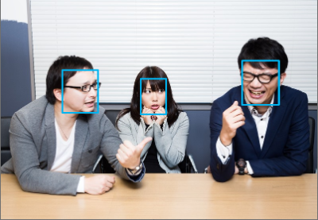|shape: `1, 3, 300, 300` in the format `B, C, H, W`|shape: `1, 1, 200, 7` in the format `1, 1, N, 7` `[image_id, label, conf, x_min, y_min, x_max, y_max]`|  |
|[person-detection-0106](./open_model_zoo-master/models/intel/person-detection-0106)||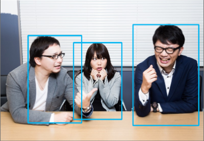|shape: `1, 3, 800, 1344` in the format `B, C, H, W`|`boxes` shape: `-1, 5` in the format `N, 5``[x_min, y_min, x_max, y_max, conf]` `labels` shape `-1` in the format `N`|  |
|[age-gender-recognition-retail-0013](./open_model_zoo-master/models/intel/age-gender-recognition-retail-0013)||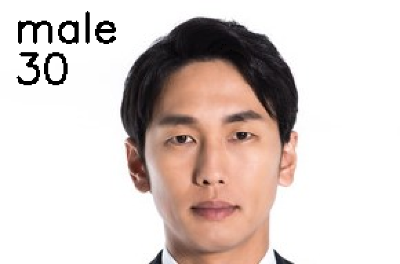|shape: `1, 3, 62, 62` in `1, C, H, W` format|`age` shape: `1, 1, 1, 1` - Estimated age divided by 100 `gender`, shape: `1, 2, 1, 1` - Softmax output across 2 type classes `[0 - female, 1 - male]`|  |
|[face-reidentification-retail-0095](./open_model_zoo-master/models/intel/face-reidentification-retail-0095)||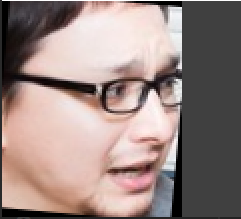`similarity: [ 0.9999997   0.16601375 -0.01505139]`|shape: `1, 3, 128, 128` in the format `B, C, H, W`| shape `1, 256, 1, 1` `[left eye, right eye, tip of nose, left lip corner, right lip corner]`|  |
|[landmarks-regression-retail-0009](./open_model_zoo-master/models/intel/landmarks-regression-retail-0009)||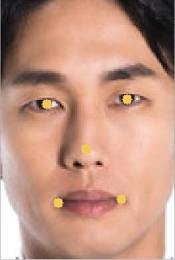|shape: `1, 3, 48, 48` in the format `B, C, H, W`| shape: `1, 10, 1, 1`, containing a row-vector of 10 floating point values for five landmarks coordinates in the form (x0, y0, x1, y1, ..., x4, y4). All the coordinates are normalized to be in range [0, 1].|  |
|[facial-landmarks-35-adas-0002](./open_model_zoo-master/models/intel/facial-landmarks-35-adas-0002)||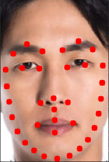|shape: `1, 3, 60, 60` in the format `B, C, H, W`|shape: `1, 70`, containing row-vector of 70 floating point values for 35 landmarks' normed coordinates in the form (x0, y0, x1, y1, ..., x34, y34)|  |
|[head-pose-estimation-adas-0001](./open_model_zoo-master/models/intel/head-pose-estimation-adas-0001)||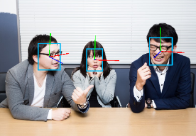| shape:`1, 3, 60, 60` in `1, C, H, W` |`yaw, pitch roll` shape: `1, 1`|  |
|[gaze-estimation-adas-0002](./open_model_zoo-master/models/intel/gaze-estimation-adas-0002)||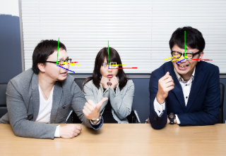|name: `left_eye_image`, shape: `1, 3, 60, 60` in the format `B, C, H, W`.name: `right_eye_image`, shape: `1, 3, 60, 60` in the format `B, C, H, W`. name: `head_pose_angles`, shape: `1, 3` in the format `B, C`|name `gaze_vector` and the shape: `1, 3`|  |
|[human-pose-estimation-0001](./open_model_zoo-master/models/intel/human-pose-estimation-0001)||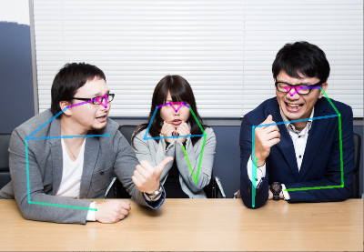|shape: `1, 3, 256, 456` in the `B, C, H, W`|`Mconv7_stage2_L1`, shape: `1, 38, 32, 57` contains keypoint pairwise relations (part affinity fields).`Mconv7_stage2_L2`, shape: `1, 19, 32, 57` contains keypoint heatmaps.|  |
|[person-vehicle-bike-detection-2000](./open_model_zoo-master/models/intel/person-vehicle-bike-detection-2000)||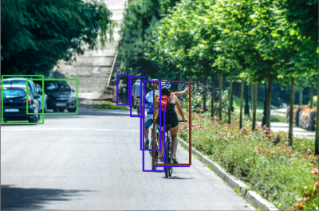|shape: `1, 3, 256, 256` in the format `B, C, H, W`|shape: `1, 1, 200, 7` in the format `1, 1, N, 7`, where N is the number of detected bounding boxes. Each detection has the format `[image_id, label, conf, x_min, y_min, x_max, y_max]`|  |
|[pedestrian-and-vehicle-detector-adas-0001](./open_model_zoo-master/models/intel/pedestrian-and-vehicle-detector-adas-0001)||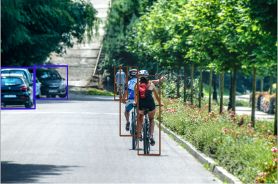|shape: `1, 3, 384, 672` in the format `B, C, H, W`|shape: `1, 1, 200, 7` in the format `1, 1, N, 7`, where N is the number of detected bounding boxes. Each detection has the format `[image_id, label, conf, x_min, y_min, x_max, y_max]`|  |
|[horizontal-text-detection-0001](./open_model_zoo-master/models/intel/horizontal-text-detection-0001)|||shape: `1, 3, 704, 704` in the format `1, C, H, W`|shape `100, 5` in the format `N, 5`: `[x_min, y_min, x_max, y_max, conf]`|  |
|[text-recognition-0012](./open_model_zoo-master/models/intel/text-recognition-0012)||`openvino`|shape: `1, 32, 120, 1` in the format `B, H, W, C`|shape `30, 1, 37` in the format `W, B, L`|  |
|[product-detection-0001](./open_model_zoo-master/models/intel/product-detection-0001)|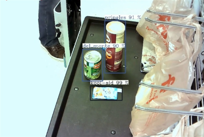|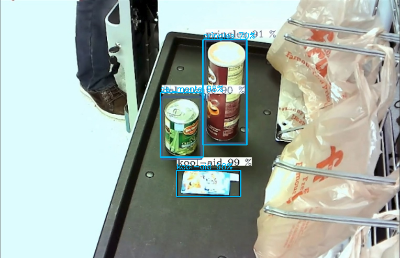|shape: `1, 3, 512, 512` in the format `B, C, H, W`|shape: `1, 1, 200, 7` in the format `1, 1, N, 7`, where N is the number of detected bounding boxes. For each detection, the description has the `[image_id, label, conf, x_min, y_min, x_max, y_max]` |  |
|[license-plate-recognition-barrier-0001](./open_model_zoo-master/models/intel/license-plate-recognition-barrier-0001)|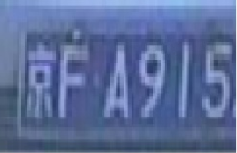|`<Beijing>FA915M`|`data`, shape: `1, 3, 24, 94` in the format `1, C, H, W` `seq_ind`, shape: `88,1``[1, 1, 1, ..., 1]`|shape: `1, 88, 1, 1`|  |
|[person-attributes-recognition-crossroad-0230](./open_model_zoo-master/models/intel/person-attributes-recognition-crossroad-0230)||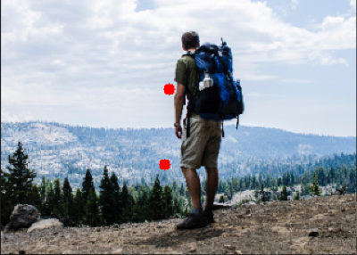`is_male`,`has_bag`,`has_backpack`|shape: `1, 3, 160, 80` in the format `1, C, H, W`|`453` with shape: `1, 8, 1, 1`: `[is_male, has_bag, has_backpack, has_hat, has_longsleeves, has_longpants, has_longhair, has_coat_jacket]``456` with shape: `1, 2, 1, 1` `459` with shape: `1, 2, 1, 1`||
|[instance-segmentation-security-0002](./open_model_zoo-master/models/intel/instance-segmentation-security-0002)|||shape: `1, 3, 768, 1024` in the format `1, C, H, W`|`labels`, shape: `-1` `boxes`, shape: `-1, 5` `top_left_x, top_left_y, bottom_right_x, bottom_right_y` and `confidence score` in range [0, 1].`masks`, shape: `-1, 28, 28`|  |
|[road-segmentation-adas-0001](./open_model_zoo-master/models/intel/road-segmentation-adas-0001)||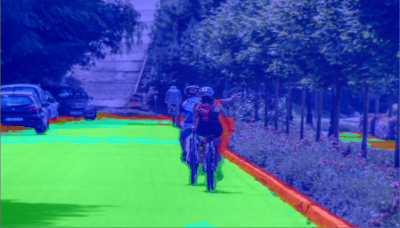|shape `1, 3, 512, 896` in the format `B, C, H, W`|shape `1, 4, 512, 896` in the format `B, C, H, W` classes: BG, road, curb, mark|  |
|[action-recognition-0001](./open_model_zoo-master/models/intel/action-recognition-0001)|||`Encoder`shape: `1, 3, 224, 224` in the format `B, C, H, W` `Decoder`shape: `1, 16, 512` in the format `B, T, C`|`Encoder` `1, 512, 1, 1`、`Decoder`shape `1, 400`|  |
|[driver-action-recognition-adas-0002](./open_model_zoo-master/models/intel/driver-action-recognition-adas-0002)|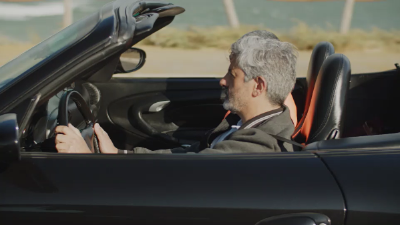|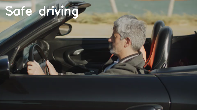|`Encoder`shape: `1, 3, 224, 224` in the format `B, C, H, W` `Decoder`shape: `1, 16, 512` in the format `B, T, C`|`Encoder` `1, 512, 1, 1`、`Decoder`shape `1, 400`|  |
|[asl-recognition-0004](./open_model_zoo-master/models/intel/asl-recognition-0004)|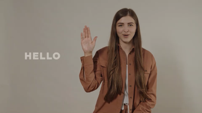|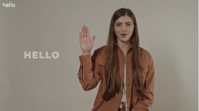|shape: `1, 3, 16, 224, 224` in the format `B, C, T, H, W`|shape `1, 100` in the format `B, L`|  |
|[common-sign-language-0002](./open_model_zoo-master/models/intel/common-sign-language-0002)||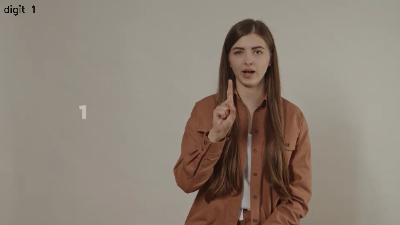|shape: `1, 3, 8, 224, 224` in the format `B, C, T, H, W`|shape `1, 12` in the format `B, L`|  |
|[handwritten-japanese-recognition-0001](./open_model_zoo-master/models/intel/handwritten-japanese-recognition-0001)|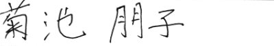|`菊池朋子`|shape - `1, 1, 96, 2000`, format is `B, C, H, W`|shape - `186, 1, 4442`, format is `W, B, L`|  |
